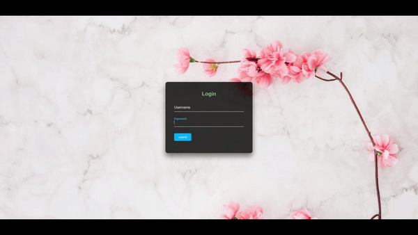

# Form-login-transparent
Formulário de login transparente com o texto do placeholder flutuante, usando apenas CSS e HTML. Pure CSS Label Slide Up on Focus

Inicio da série de estudos avançados com CSS.

